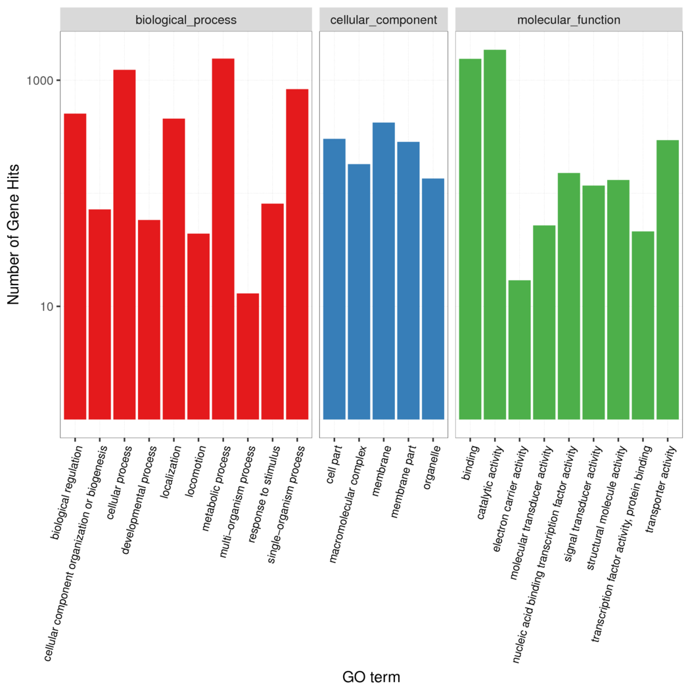

# GO_figure
GO level 2 summary and barplot

# Description
This script count the number of gene of Gene Ontology(GO) level 2, and draw the bar chart.

The Gene Ontology website: [http://geneontology.org/](http://geneontology.org/)

Of course, you can try this [http://wego.genomics.org.cn/cgi-bin/wego/index.pl](http://wego.genomics.org.cn/cgi-bin/wego/index.pl), it do the same thing.

# Required
+ python3
+ obo_parser, from [https://github.com/tanghaibao/goatools](https://github.com/tanghaibao/goatools)
+ R and ggplot2

# Usage
python3 GO\_figure.py -i \<gene\_go\_file\> -o \<out\_prefix\> -l level2 --obo \<go-basic.obo\>

picture example：

